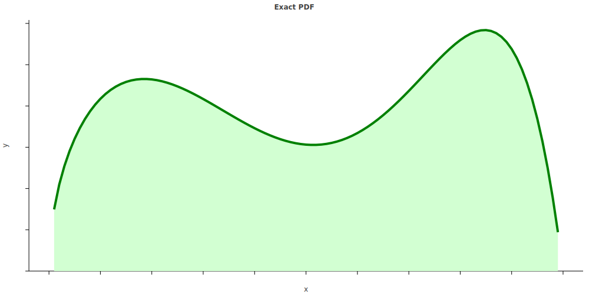
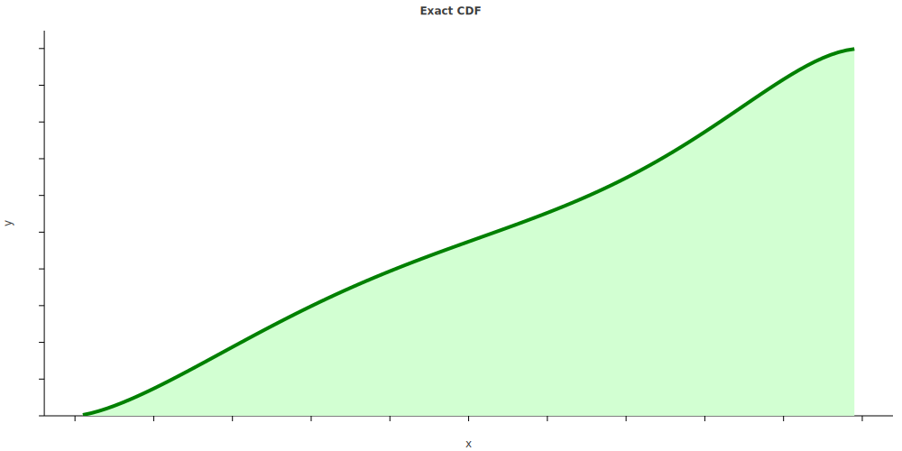
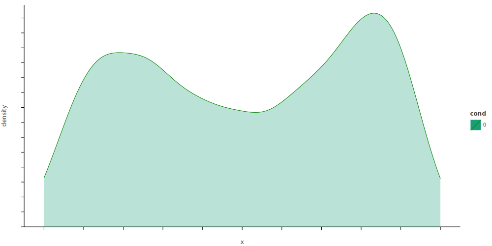

# Katholic

> "We may throw the dice—but the Lord determines how they fall." —Proverbs 16:33

Symbolic integration and probabilistic programming in the spirit of [Church](https://web.stanford.edu/~ngoodman/papers/churchUAI08_rev2.pdf) and [Anglican](https://probprog.github.io/anglican/index.html).

# Research Questions

* Is there a probability distribution which can be combined linearly to form an algebra which is closed over integration?
* Is there an efficient symbolic or numerical procedure to run inverse transform sampling on higher dimensional quantiles?
* If not, can we use approximate inference methods like [SVGD](https://www.depthfirstlearning.com/2020/SVGD) or [normalizing flows](https://lilianweng.github.io/lil-log/2018/10/13/flow-based-deep-generative-models.html) to draw samples from probabilistic programs?

# Example

Below, we show the posterior distribution from simple mixture of two Kumaraswamy distributions. The CDF is computed using [Rubi's symbolic integration scheme](https://rulebasedintegration.org/).

# References

## Symbolic Methods

* [APPL: A Probability Programming Language](https://www.tandfonline.com/doi/pdf/10.1198/000313001750358509), Glen et al. (2012)
* [Symbolic Statistics with SymPy](http://people.cs.uchicago.edu/~mrocklin/tempspace/sympystats.pdf), Rocklin (2010)
* [Symbolic Exact Inference for Discrete Probabilistic Programs](https://arxiv.org/pdf/1904.02079.pdf), Holtzen et al. (2019)
* [PSI: Exact Symbolic Inference for Probabilistic Programs](https://files.sri.inf.ethz.ch/website/papers/psi-solver.pdf), Gehr et al. (2016)
* [λPSI: Exact Inference for Higher-Order Probabilistic Programs](https://files.sri.inf.ethz.ch/website/papers/pldi20-lpsi.pdf), Gehr et al. (2020)
* [Symbolic Maximum Likelihood Estimation with Mathematica](https://rss.onlinelibrary.wiley.com/doi/pdf/10.1111/1467-9884.00233), Rose and Smith (2001)
* [The Harmonic Logarithms and the Binomial Formula](https://core.ac.uk/download/pdf/82415331.pdf), Roman (1993)
* [Closed Form Integration of Artificial Neural Networks](https://escholarship.org/content/qt0wz7n7nm/qt0wz7n7nm.pdf#page=5), Gottschling (1999)
* [A New Distribution on the Simplex with Auto-Encoding Applications](https://papers.nips.cc/paper/9520-a-new-distribution-on-the-simplex-with-auto-encoding-applications.pdf), Stirn et al. (2019)
* [Theano: A Python framework for fast computation of mathematical expressions](https://arxiv.org/pdf/1605.02688.pdf#section*.12), Al-Rfou et al. (2016)

## Algebraic Methods

* [The Generalized Distributive Law](https://authors.library.caltech.edu/1541/1/AJIieeetit00.pdf), Aji and McEliece (2000)
* [A Logical Approach for Factoring Belief Networks](http://reasoning.cs.ucla.edu/fetch.php?id=24&type=pdf), Darwiche (2002)
* [Transforming Probabilistic Programs into Algebraic Circuits for Inference and Learning](https://openreview.net/pdf?id=SygbjU6iBS), Martires et al. (2019)
* [Algebra of inference in graphical models revisited](https://www.researchgate.net/profile/Russ_Greiner/publication/266262013_Algebra_of_inference_in_graphical_models_revisited/links/543bb0350cf204cab1db12fa/Algebra-of-inference-in-graphical-models-revisited.pdf), Ravanbakhsh and Greiner (2014)
* [Boolean Matrix Factorization and Noisy Completion via Message Passing](http://proceedings.mlr.press/v48/ravanbakhsha16-supp.pdf), Ravanbakhsh et al. (2016)
* [Bayesian Boolean Matrix Factorisation](https://arxiv.org/pdf/1702.06166.pdf), Rukat et al. (2017)
* [Methods and Applications of (max,+) Linear Algebra](https://hal.inria.fr/inria-00073603/document), Gaubert (2006)

## Sum-Product Networks

* [Sum-product networks: A survey](https://arxiv.org/pdf/2004.01167.pdf), París et al. (2020)
* [Sum-Product Networks: A New Deep Architecture](http://spn.cs.washington.edu/spn/poon11.pdf), Poon and Domingos (2012) [[source code](http://spn.cs.washington.edu/spn/downloadspn.php), [user guide](http://spn.cs.washington.edu/spn/spn-user-guide.pdf)]
* [Learning the Structure of Sum-Product Networks](https://homes.cs.washington.edu/~pedrod/papers/mlc13.pdf) Gens and Domingos (2013) [[source code](http://spn.cs.washington.edu/learnspn/)]
* [Learning Markov Networks With Arithmetic Circuits](http://ix.cs.uoregon.edu/~lowd/aistats13lowd.pdf), Lowd and Rooshenas (2012)
* [Tractable Operations for Arithmetic Circuits of Probabilistic Models](https://papers.nips.cc/paper/6363-tractable-operations-for-arithmetic-circuits-of-probabilistic-models.pdf), Shen, Choi and Darwiche (2016)
* [On Relaxing Determinism in Arithmetic Circuits](https://arxiv.org/pdf/1708.06846.pdf), Choi and Darwiche (2017)
* [The Sum-Product Theorem: A Foundation for Learning Tractable Models](https://homes.cs.washington.edu/~pedrod/papers/mlc16.pdf), Friesen (2016)
* [The Sum-Product Theorem and its Applications](https://digital.lib.washington.edu/researchworks/bitstream/handle/1773/40872/Friesen_washington_0250E_18101.pdf), Friesen (2016)
* [Learning and Inference in Tractable Probabilistic Knowledge Bases](https://homes.cs.washington.edu/~pedrod/papers/uai15.pdf), Niepert and Domingos (2015)
* [Combining Sum-Product Network and Noisy-Or Model for Ontology Matching](http://disi.unitn.it/~pavel/om2015/papers/om2015_TSpaper1.pdf), Li (2015)
* [Compiling Probabilistic Graphical Models Using Sentential Decision Diagrams](http://reasoning.cs.ucla.edu/fetch.php?id=129&type=pdf), Choi, Kisa and Darwiche (2013)
* [On the Relationship between Sum-Product Networks and Bayesian Networks](https://arxiv.org/pdf/1501.01239.pdf) Zhao et al. (2015) [[slides](https://pdfs.semanticscholar.org/e6ae/d5eb4d3330ed0024063dc64226517bc41fb7.pdf)]
* [Two Reformulation Approaches to Maximum-A-Posteriori Inference in Sum-Product Networks](https://www.alessandroantonucci.me/papers/maua2020a.pdf), Maua et al. (2020)
* [Sum-Product Graphical Models](https://ipa.iwr.uni-heidelberg.de/dokuwiki/Papers/Desana2020aa.pdf), Desana and Schnörr (2020)

## Fast Sampling/Inference

* [Affine Algebraic Decision Diagrams (AADDs) and their Application to Structured Probabilistic Inference](http://users.cecs.anu.edu.au/~ssanner/Papers/aadd.pdf), Sanner and McAllester (2005)
* [Faster Algorithms for Max-Product Message-Passing](https://cseweb.ucsd.edu/~jmcauley/pdfs/jmlr11.pdf), McAuley and Caetano (2011)
* [Fast inverse transform sampling in one and two dimensions](https://arxiv.org/pdf/1307.1223.pdf), Olver and Townsend (2013)
* [Fast and accurate parallel quantile computation](https://discovery.ucl.ac.uk/id/eprint/1482128/1/Luu_thesis.pdf#page=12), Luu (2016)
* [Fast Random Integer Generation in an Interval](https://arxiv.org/pdf/1805.10941.pdf), Lemire (2018)

## Basic Understanding

* [How to Combine Independent Data Sets for the Same Quantity](https://arxiv.org/pdf/1005.4978.pdf), Hill and Miller (2010)

<!-- ## Normalizing Flows -->

<!-- * [Normalizing Flows for Probabilistic Modeling and Inference](https://arxiv.org/pdf/1912.02762.pdf), Papamakarios et al. (2019) -->
<!-- * [Efficient Inference Amortization in Graphical Models using Structured Continuous Conditional Normalizing Flows](http://proceedings.mlr.press/v108/weilbach20a/weilbach20a.pdf) Weilbach et al. (2020) -->

## Software

* [SPFlow: An easy and extensible library for deep probabilistic learning using sum-product networks](https://arxiv.org/pdf/1901.03704.pdf), Molina et al. (2019) [[source code](https://github.com/SPFlow/SPFlow)]
* [CREMA: A Java Library for Credal Network Inference](https://pgm2020.cs.aau.dk/wp-content/uploads/2020/09/huber20.pdf), Huber et al. (2020) [[source code](https://github.com/IDSIA/crema)]
* [CREDICI: A Java Library for Causal Inference by Credal Networks](https://pgm2020.cs.aau.dk/wp-content/uploads/2020/09/cabanas20a.pdf), Cabañas et al. (2020) [[source code](https://github.com/IDSIA/credici)]
* [JavaBayes: Bayesian networks in Java](https://people.montefiore.uliege.be/lwh/javabayes/javabayes-manual-0.346.pdf), Cozman (2001) [[source code](https://github.com/joeschweitzer/javabayes)]
* [Dimple: Java and Matlab libraries for probabilistic inference](https://s3.amazonaws.com/files.dimple.probprog.org/DimpleUserManual_v0.07_Java_API.pdf) [[source code](https://github.com/analog-garage/dimple)]
* [Theano-PyMC](https://pymc-devs.medium.com/the-future-of-pymc3-or-theano-is-dead-long-live-theano-d8005f8a0e9b), Willard (2020) [[source code](https://github.com/pymc-devs/Theano-PyMC)]
